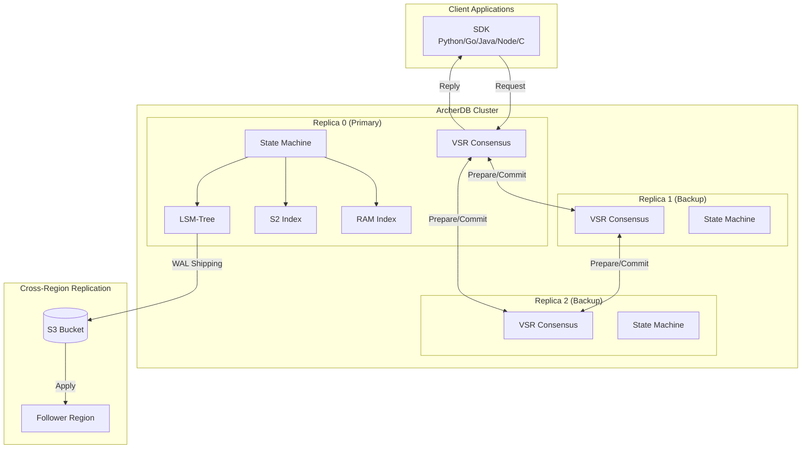
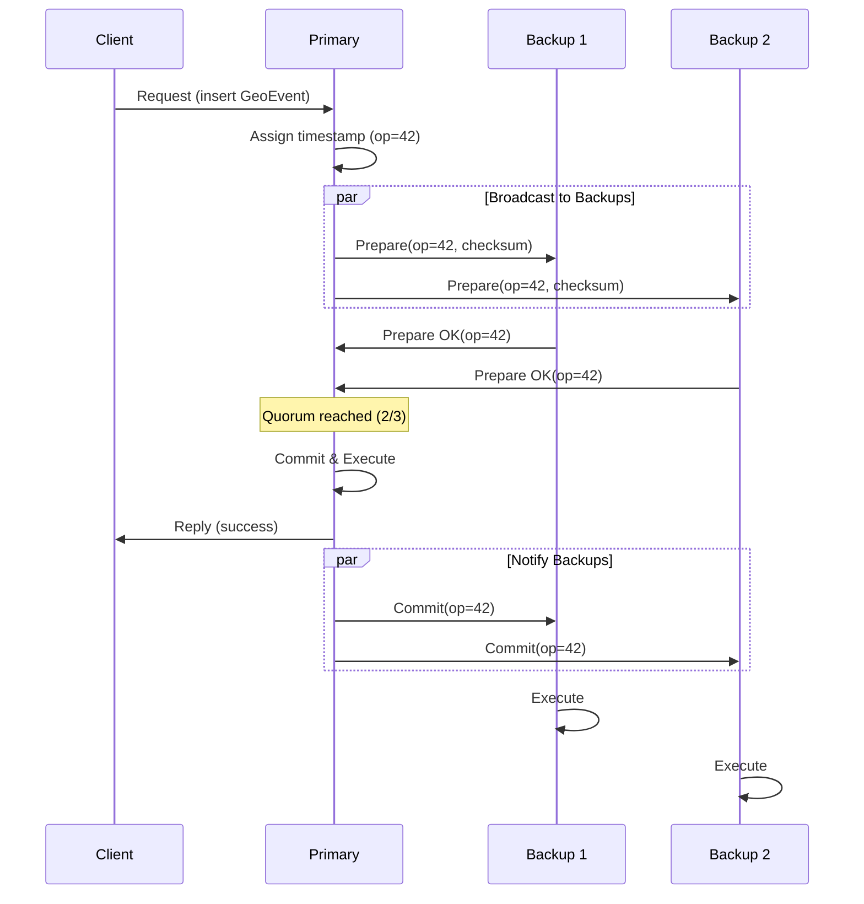
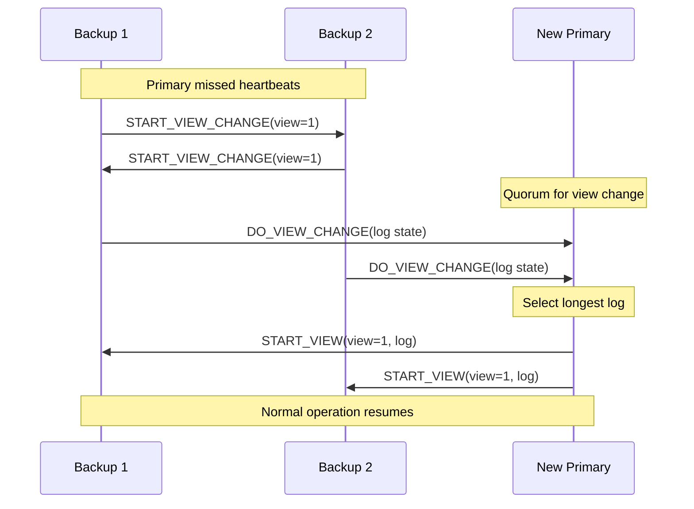
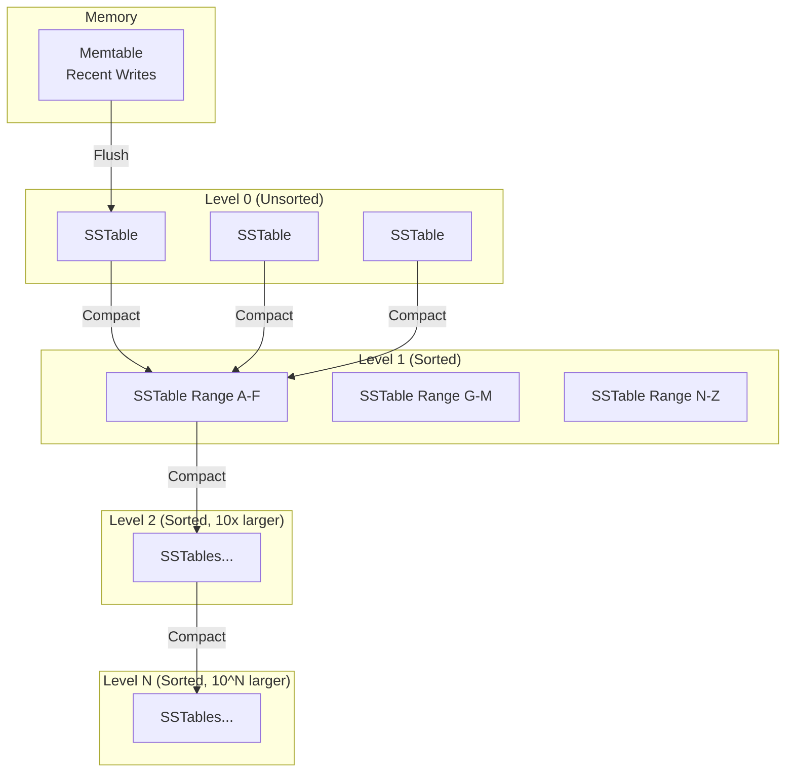
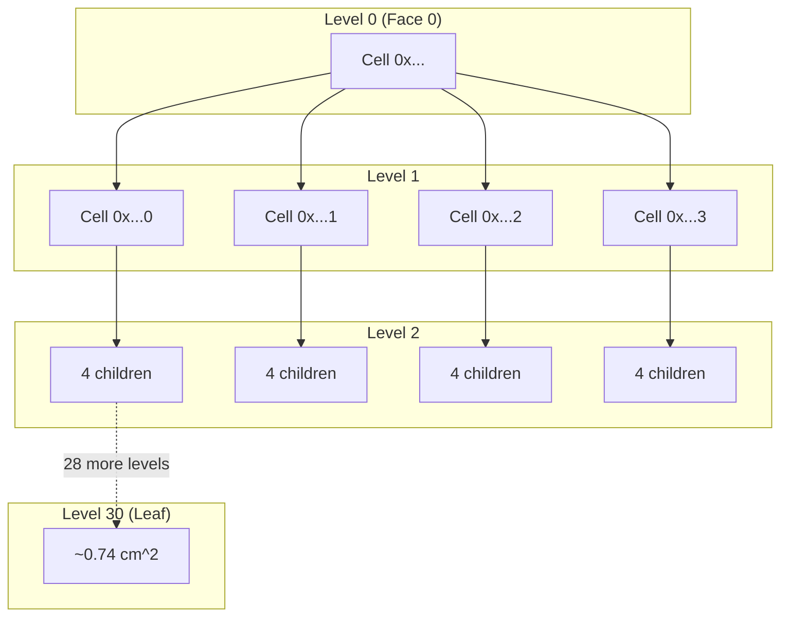
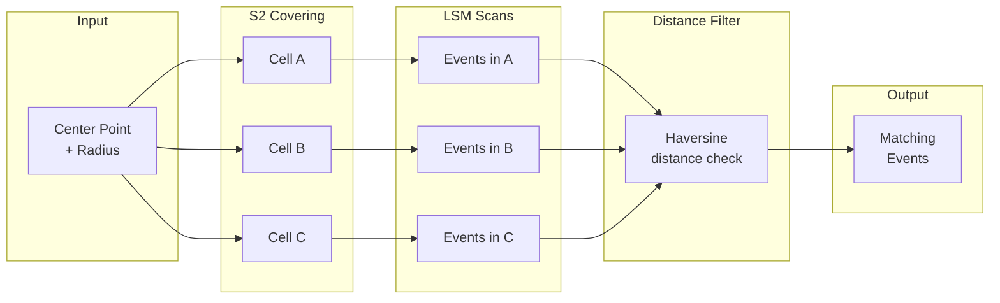
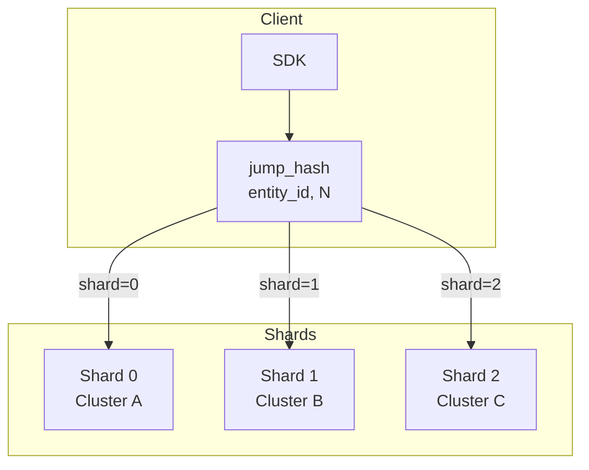
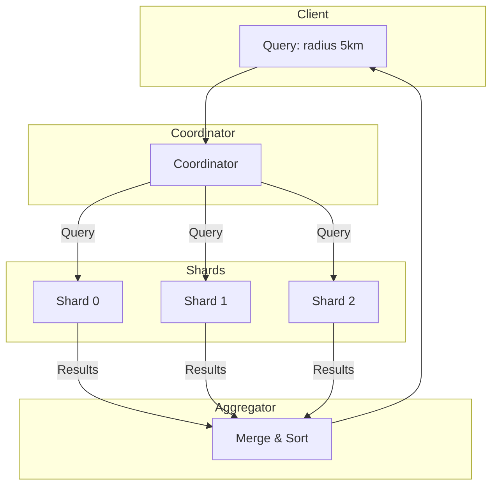
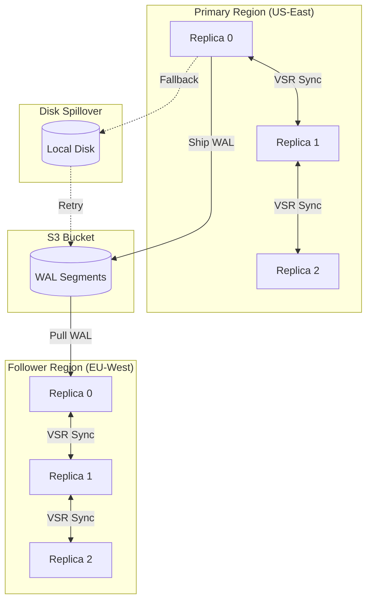
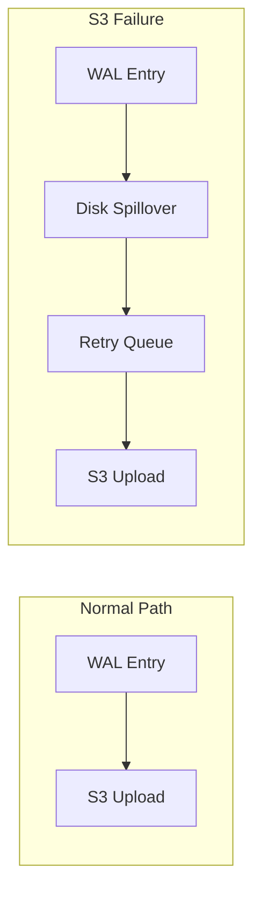

# ArcherDB Architecture

This document provides a comprehensive deep-dive into ArcherDB's architecture, explaining how the system works internally and why specific design decisions were made.

## Key Concepts

Before diving into details, here are the essential concepts that define ArcherDB's behavior:

| Concept | What It Means for Users |
|---------|------------------------|
| **Linearizability** | All operations appear to execute atomically in a single global order. A read always returns the result of the most recent write - no stale data, no anomalies. |
| **Quorum** | A majority of replicas (2 of 3, or 3 of 5) must agree before any write is committed. This guarantees durability even if minority replicas fail. |
| **Leader Election** | When the primary fails, remaining replicas automatically elect a new leader within seconds. No manual intervention required. |
| **S2 Cells** | Locations are indexed using Google's S2 geometry library. Nearby points have numerically close cell IDs, enabling efficient spatial queries. |
| **LSM Tree** | Write-optimized storage that achieves high throughput by writing sequentially. Background compaction keeps read performance consistent. |

**Quick Links:**
- [VSR Consensus Protocol](#viewstamped-replication-vsr) - How data stays consistent
- [LSM-Tree Storage](#lsm-tree-storage) - How data is persisted
- [S2 Geospatial Indexing](#s2-geospatial-indexing) - How spatial queries work
- [RAM Index](#ram-index) - How "where is entity X?" queries are fast

## Table of Contents

1. [Introduction](#introduction)
2. [System Overview](#system-overview)
3. [Viewstamped Replication (VSR)](#viewstamped-replication-vsr)
4. [LSM-Tree Storage](#lsm-tree-storage)
5. [S2 Geospatial Indexing](#s2-geospatial-indexing)
6. [RAM Index](#ram-index)
7. [Sharding](#sharding)
8. [Replication](#replication)
9. [Summary](#summary)

---

## Introduction

ArcherDB is a distributed geospatial database designed for real-time location tracking at scale. It provides sub-millisecond queries for millions of moving entities while guaranteeing strong consistency and durability.

### Design Principles

ArcherDB follows three core principles:

1. **Correctness First**: The system never returns stale data or loses acknowledged writes. Consensus (VSR) ensures all replicas agree on operation order, and durability guarantees survive any single point of failure.

2. **No Compromises**: Rather than degrading gracefully under resource pressure, ArcherDB demands adequate resources and exposes problems through metrics and traces. This philosophy prevents silent data corruption and makes capacity issues visible before they become critical.

3. **Purpose-Built for Geospatial**: Every component is optimized for location data - from the S2 spatial indexing to the composite key design that enables efficient range queries over space and time.

### Target Use Cases

ArcherDB excels at workloads where you need to:

- **Fleet Management**: Track thousands of vehicles in real-time, query "which trucks are within 5km of this warehouse?"
- **Asset Tracking**: Monitor equipment, containers, or inventory across facilities with instant location lookup
- **Ride-Sharing & Delivery**: Match riders to nearby drivers, optimize delivery routes based on current positions
- **Logistics & Supply Chain**: Real-time visibility into shipment locations with historical trajectory analysis

### What Makes ArcherDB Different

Unlike general-purpose databases with geospatial extensions (PostGIS, MongoDB) or in-memory stores (Redis/Tile38), ArcherDB is built from the ground up for distributed location tracking:

| Capability | ArcherDB | PostGIS | Redis/Tile38 |
|------------|----------|---------|--------------|
| Linearizable consistency | Yes (VSR) | Yes (single node) | No |
| Automatic failover | Yes | No | Cluster mode |
| Purpose-built spatial index | S2 (Hilbert curve) | GiST/R-tree | Geohash |
| Write throughput | 1M+ ops/sec | 10K ops/sec | 100K ops/sec |
| Multi-region replication | Yes (async) | Manual | No |

---

## System Overview

ArcherDB consists of several interconnected components that work together to provide fast, consistent geospatial operations.

### High-Level Architecture



### Component Responsibilities

| Component | Responsibility | Key Feature |
|-----------|----------------|-------------|
| **VSR Consensus** | Ensures all replicas agree on operation order | Linearizability, automatic failover |
| **State Machine** | Executes operations deterministically | Geospatial operations, TTL expiration |
| **LSM-Tree** | Durable sorted storage for GeoEvents | Write optimization, range scans |
| **S2 Index** | Spatial queries (radius, polygon) | Hilbert curve locality |
| **RAM Index** | O(1) latest position lookup | 64-byte cache-aligned entries |

### Request Flow

When a client sends a request (e.g., "insert location for vehicle X"):

1. **SDK** serializes the request and sends to the primary replica
2. **VSR** assigns a timestamp and broadcasts to all replicas (Prepare phase)
3. **Backups** acknowledge receipt (Prepare OK)
4. **Primary** commits after quorum acknowledgment
5. **State Machine** executes the operation deterministically
6. **LSM-Tree** persists the GeoEvent durably
7. **RAM Index** updates the latest position cache
8. **S2 Index** enables future spatial queries
9. **Client** receives success response

---

## Viewstamped Replication (VSR)

VSR is ArcherDB's consensus protocol, providing strong consistency guarantees across replicas. It ensures that even if replicas fail, the system continues operating correctly without data loss.

### What VSR Provides

- **Linearizability**: All operations appear to execute atomically in a single global order. A read always sees the result of all previously committed writes.
- **Durability**: Once a write is acknowledged, it survives any minority of replica failures (e.g., 1 failure in a 3-node cluster, 2 failures in a 5-node cluster).
- **Automatic Failover**: When the primary fails, backups elect a new primary within seconds without manual intervention.

### Why VSR Over Raft or Paxos?

ArcherDB inherits VSR from TigerBeetle, which chose it for several reasons:

1. **No Log Truncation**: Unlike Raft, VSR never truncates committed entries. This simplifies crash recovery and eliminates a class of subtle bugs.

2. **Deterministic Replay**: The same sequence of operations produces identical state on all replicas, enabling VOPR (Viewstamped Operation Prover) simulation testing.

3. **Battle-Tested**: TigerBeetle has run VSR through millions of hours of deterministic simulation, finding and fixing edge cases that would be nearly impossible to discover through traditional testing.

### How VSR Works

VSR operates in two main phases: Prepare (replication) and Commit (execution).



### Key Concepts

**View**: A configuration where one replica is designated as primary. The view number increases monotonically when leadership changes. In view 0, replica 0 is primary; in view 1, replica 1 is primary; and so on (modulo replica count).

**Prepare**: The primary assigns a monotonically increasing operation number and broadcasts the operation to all backups. The operation is hash-chained to its predecessor for integrity verification.

**Commit**: After receiving acknowledgments from a quorum (majority) of replicas, the primary commits the operation. This guarantees the operation is durable - even if the primary fails immediately after, the operation can be recovered.

**View Change**: When backups detect the primary has failed (missed heartbeats), they initiate a view change to elect a new primary. The protocol ensures no committed operations are lost during the transition.

### View Change Protocol

When the primary fails, VSR performs a three-phase view change:



The new primary collects the log state from a quorum and selects the most complete version, ensuring no committed operations are lost.

### Key Invariants

VSR maintains several invariants that guarantee correctness:

1. **Op Ordering**: Operation numbers strictly increase, and the hash chain enforces that all replicas process operations in the same order.

2. **Commit Safety**: An operation is only committed after quorum acknowledgment, preventing data loss on primary failure.

3. **View Monotonicity**: View numbers only increase, preventing split-brain scenarios where two replicas both believe they are primary.

4. **Primary Uniqueness**: At most one primary exists per view, determined by `primary_index = view % replica_count`.

For deeper technical details on VSR internals, see [vsr_understanding.md](vsr_understanding.md).

---

## LSM-Tree Storage

ArcherDB uses a Log-Structured Merge-tree (LSM) for persistent storage, optimized for write-heavy location tracking workloads.

### What LSM Provides

- **Write Optimization**: Sequential writes to disk (append-only) achieve much higher throughput than random writes (B-tree updates).
- **Sorted Storage**: Data is sorted by key, enabling efficient range scans - crucial for "all events in this time range" or "all events in this spatial cell" queries.
- **Space Reclamation**: Background compaction merges levels and eliminates deleted/expired data without blocking writes.

### Why LSM Over B-Tree?

Location tracking is inherently write-heavy: every vehicle reports its position every few seconds. LSM trees excel at this workload:

| Metric | LSM-Tree | B-Tree |
|--------|----------|--------|
| Write pattern | Sequential (fast) | Random (slow) |
| Write amplification | 10-30x | 2-3x |
| Read amplification | Higher (check multiple levels) | Lower (single tree) |
| Space amplification | Lower (compaction) | Higher (page splits) |

For ArcherDB's workload (many writes, fewer reads, mostly recent data), LSM's trade-offs are favorable.

### LSM Structure

Data flows through the LSM tree in levels:



### Write Path

1. **Memtable**: Writes first go to an in-memory sorted structure (memtable)
2. **Flush**: When the memtable fills, it's flushed to Level 0 as an immutable SSTable
3. **Level 0**: Contains recent SSTables with potentially overlapping key ranges
4. **Compaction**: Background process merges L0 files into L1, then L1 into L2, etc.

Each level is ~10x larger than the previous (configurable via `lsm_growth_factor`).

### Read Path

To read a key:

1. **Check Memtable**: If key is in memory, return immediately (fastest)
2. **Check Level 0**: Scan all L0 files (they may overlap)
3. **Binary Search Levels 1-N**: Each level is sorted, so binary search finds the right file, then the right block within the file

ArcherDB uses **key-range filtering** instead of bloom filters: each file's index block stores min/max keys, allowing quick elimination of files that can't contain the target key.

### Compaction

Compaction keeps the LSM tree healthy by:

- **Merging overlapping key ranges**: Combines files with the same keys, keeping only the newest version
- **Eliminating tombstones**: Deleted data is physically removed when tombstones reach the deepest level
- **Maintaining sorted order**: Each level (except L0) has non-overlapping key ranges

ArcherDB's compaction has dedicated I/O resources (18 read IOPS, 17 write IOPS) that are separate from foreground operations, preventing compaction from causing latency spikes.

### Tuning

Key tuning parameters:

| Parameter | Enterprise | Mid-Tier | Effect |
|-----------|------------|----------|--------|
| `lsm_levels` | 7 | 6 | More levels = higher capacity but more read amplification |
| `lsm_growth_factor` | 8 | 10 | Higher = fewer levels needed, but more data per compaction |
| `lsm_compaction_ops` | 64 | 32 | More = larger memtable, fewer flushes |
| `block_size` | 512 KiB | 256 KiB | Larger = better throughput, worse random read latency |

For detailed tuning guidance, see [lsm-tuning.md](lsm-tuning.md).

---

## S2 Geospatial Indexing

S2 is Google's spherical geometry library that ArcherDB uses for spatial indexing. It provides efficient "find all entities within this area" queries.

### What S2 Is

S2 projects Earth's surface onto a cube, then unfolds the cube into a 2D plane using a Hilbert curve. This creates a hierarchical decomposition where:

- **Level 0**: 6 cells (cube faces), each ~85 million km^2
- **Level 30**: ~4.6 billion cells per face, each ~0.74 cm^2

Each cell has a 64-bit ID that encodes both its position and level.

### Why S2 Over Geohash or R-Tree?

**Geohash** (used by Redis) has significant problems:

- **Edge discontinuities**: Adjacent cells at the equator or prime meridian may have very different hash values
- **No hierarchy**: Parent/child relationships require string manipulation
- **Polar distortion**: Cells become extremely thin near poles

**R-Trees** (used by PostGIS) have different trade-offs:

- **Dynamic rebalancing**: Tree structure changes with inserts, complicating distributed systems
- **Non-deterministic**: Different insert orders produce different tree shapes
- **Memory overhead**: Internal node structures consume significant memory

**S2's advantages**:

- **Locality preservation**: The Hilbert curve ensures nearby points have numerically close cell IDs, making range scans efficient
- **Deterministic**: Same coordinates always produce the same cell ID
- **Hierarchical**: Parent and child cells are computed with bit operations (O(1))
- **No edge discontinuities**: The cube projection handles Earth's curvature gracefully

### How S2 Cells Work

The S2 cell hierarchy forms a quad-tree where each cell has exactly 4 children:



Cell IDs are structured so that a cell's children can be computed with simple bit operations:

```
Parent cell:  0x89c258...00  (level 15)
Child 0:      0x89c258...00  (level 16)
Child 1:      0x89c258...40  (level 16)
Child 2:      0x89c258...80  (level 16)
Child 3:      0x89c258...c0  (level 16)
```

### Query Flow

**Radius Query**: "Find all entities within 1km of this point"

1. **Compute covering**: Generate S2 cells that cover the 1km circle
2. **Scan cells**: For each covering cell, query the LSM tree for events in that cell range
3. **Filter by distance**: For each candidate, compute exact distance and filter out false positives



**Polygon Query**: "Find all entities within this delivery zone"

1. **Compute covering**: Generate S2 cells that cover the polygon
2. **Scan cells**: Query LSM for events in covering cells
3. **Point-in-polygon test**: For candidates near polygon edges, verify with ray-casting algorithm

### Performance Characteristics

Query complexity: **O(n)** where n = entities in covering cells

The covering algorithm aims for ~8 cells by default (configurable). With good cell selection:

- A 1km radius query in a city might scan 10,000 candidates to return 100 results
- A polygon covering a neighborhood might scan 50,000 candidates to return 500 results

The key insight is that S2's Hilbert curve ordering means these candidates are stored contiguously in the LSM tree, enabling efficient sequential reads.

---

## RAM Index

The RAM Index provides O(1) lookup for "where is entity X right now?" queries - the most common operation in fleet tracking.

### What RAM Index Provides

- **O(1) Lookup**: Hash table lookup for any entity's latest position
- **Cache-Line Aligned**: 64-byte entries fit exactly in CPU cache lines for optimal performance
- **Lock-Free Reads**: Atomic operations enable concurrent reads without blocking

### Why a Separate RAM Index?

Querying the LSM tree for a single entity requires:

1. Checking the memtable (fast)
2. Potentially checking multiple L0 files (slower)
3. Binary searching through levels (slowest)

For "where is vehicle X?" queries that happen thousands of times per second, this overhead is unacceptable. The RAM index provides direct access:

```mermaid
flowchart LR
    subgraph Query["Query: entity_id=X"]
        Q[entity_id]
    end

    subgraph RAM["RAM Index"]
        HT[Hash Table<br/>O(1) lookup]
    end

    subgraph Entry["Index Entry (64 bytes)"]
        E[entity_id: 16B<br/>composite_id: 16B<br/>lat_nano: 8B<br/>lon_nano: 8B<br/>timestamp: 8B<br/>...]
    end

    Q --> HT
    HT --> E
```

### Design Details

**Index Entry Structure** (64 bytes, cache-line aligned):

| Field | Size | Purpose |
|-------|------|---------|
| `entity_id` | 16 bytes | Hash table key |
| `composite_id` | 16 bytes | S2 cell + timestamp for LSM lookup |
| `lat_nano` | 8 bytes | Latest latitude (nanodegrees) |
| `lon_nano` | 8 bytes | Latest longitude (nanodegrees) |
| `timestamp` | 8 bytes | When this position was recorded |
| `flags` | 2 bytes | Status flags (moving, offline, etc.) |
| `reserved` | 6 bytes | Future use |

**Memory Formula**:

```
RAM = capacity * 64 bytes / load_factor

For 1 billion entities at 0.70 load factor:
RAM = 1B * 64 / 0.70 = ~91.5 GB
```

This is significant but predictable. ArcherDB's "no compromises" philosophy means you provision adequate memory rather than accepting degraded performance.

### Concurrency Model

- **Writes**: Single-threaded during VSR commit phase (guaranteed by consensus)
- **Reads**: Lock-free atomic loads (multiple concurrent readers)
- **Updates**: Last-Write-Wins (LWW) semantics - newer timestamp always wins

### Persistence

The RAM index supports two modes:

1. **Heap Mode**: Faster, but lost on restart. Rebuilt by scanning the LSM tree.
2. **Mmap Mode**: File-backed with `MAP_SHARED`. Survives restarts, but slightly slower.

For most deployments, heap mode with fast LSM recovery is preferred.

---

## Sharding

Sharding distributes data across multiple ArcherDB clusters to scale beyond a single node's capacity.

### Why Shard?

A single ArcherDB cluster (3-5 nodes) handles approximately:

- 1 million writes/second
- 100 billion events storage
- 100 million entities in RAM index

For larger deployments, sharding provides:

- **Horizontal Scale**: Add more shards to handle more entities
- **Geographic Distribution**: Place shards closer to data sources
- **Isolation**: A problem in one shard doesn't affect others

### Sharding Strategy: Jump Hash

ArcherDB uses Jump Consistent Hash for shard assignment:

```
shard = jump_hash(entity_id, num_shards)
```

**Why Jump Hash?**

| Algorithm | Resharding Movement | Memory | Uniformity |
|-----------|---------------------|--------|------------|
| Modulo | ~100% (power-of-2 only) | O(1) | Good |
| Consistent Hash Ring | ~1/n | O(n) | Requires virtual nodes |
| **Jump Hash** | ~1/n | **O(1)** | **Excellent** |

Jump Hash achieves optimal resharding (only 1/n entities move when adding a shard) with no memory overhead - the algorithm is a pure function of the key and shard count.

### Shard Routing

Clients compute the shard locally - no coordinator needed for single-entity operations:



### Cross-Shard Queries

Radius and polygon queries may span multiple shards. The coordinator pattern handles this:

1. **Coordinator** receives query
2. **Fan out** to all relevant shards in parallel
3. **Aggregate** results
4. **Return** combined result set



For optimal performance, entities that are frequently queried together (same fleet, same region) should hash to the same shard. The `group_id` field enables this.

---

## Replication

ArcherDB supports two replication modes for different consistency requirements.

### Synchronous Replication (Within Region)

Within a single region, VSR provides synchronous replication:

- **Strong Consistency**: Reads always see the latest committed write
- **Automatic Failover**: If primary fails, backup takes over in seconds
- **Quorum Writes**: Writes acknowledged after majority of replicas confirm

This is the default mode for a single ArcherDB cluster.

### Asynchronous Replication (Cross-Region)

For multi-region deployments, ArcherDB uses asynchronous log shipping:



### Cross-Region Flow

1. **Primary commits** via VSR (synchronous within region)
2. **WAL entries shipped** to S3 bucket (asynchronous)
3. **Follower pulls** from S3 and applies entries
4. **Eventual consistency**: Followers lag primary by seconds to minutes

### Consistency Model

| Scope | Consistency | Lag |
|-------|-------------|-----|
| Within region | Strong (linearizable) | 0 |
| Cross-region | Eventual | Seconds to minutes |

Applications can choose:
- **Read from primary**: Always see latest data, but higher latency from distant clients
- **Read from follower**: Lower latency, but may see stale data

### Failure Handling

**S3 Unavailable**: Entries spill to local disk, then retry S3 when available



The spillover mechanism uses atomic writes (temp file + sync + rename) to guarantee durability even during crashes.

**Follower Unavailable**: WAL entries accumulate in S3 until follower recovers and catches up.

**Primary Region Failure**: Manual failover promotes a follower region to primary. This is a disaster recovery scenario requiring operator intervention.

---

## Summary

ArcherDB combines proven distributed systems techniques with purpose-built geospatial optimizations:

| Component | Technology | Why This Choice |
|-----------|------------|-----------------|
| Consensus | VSR | Linearizability, no log truncation, deterministic replay |
| Storage | LSM-Tree | Write optimization, sorted range scans |
| Spatial Index | S2 | Hilbert curve locality, deterministic, hierarchical |
| Latest Position | RAM Index | O(1) lookup, cache-aligned |
| Sharding | Jump Hash | Optimal resharding, zero memory overhead |
| Cross-Region | Async Log Shipping | Eventual consistency with durability |

### Design Trade-offs

ArcherDB makes explicit trade-offs:

1. **Memory over Disk**: RAM index uses ~91GB for 1B entities - we optimize for speed, not memory efficiency
2. **Writes over Reads**: LSM trees have read amplification - acceptable because location tracking is write-heavy
3. **Consistency over Availability**: VSR requires quorum - we choose correctness over availability during partitions
4. **Simplicity over Flexibility**: Single-purpose design - not a general-purpose database

### Further Reading

- [VSR Deep Dive](vsr_understanding.md) - Consensus protocol internals
- [LSM Tuning Guide](lsm-tuning.md) - Storage layer configuration
- [Performance Tuning](performance-tuning.md) - Optimizing for your workload
- [API Reference](api-reference.md) - Operations and endpoints
- [Durability Verification](durability-verification.md) - How we test correctness
- [Operations Runbook](operations-runbook.md) - Running ArcherDB in production
