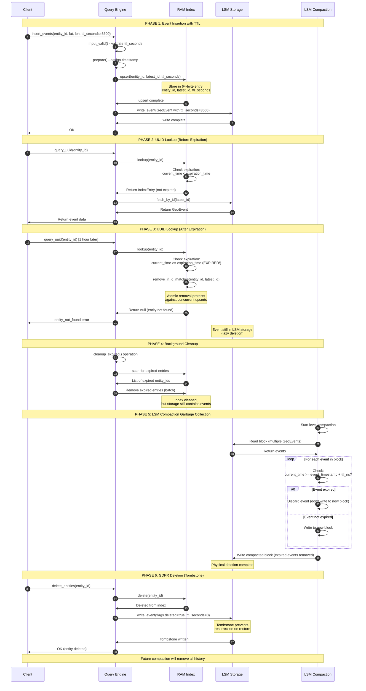

# TTL and Data Retention Specification

## ADDED Requirements

### Requirement: Per-Entry Time-to-Live (TTL)

The system SHALL support configurable time-to-live on individual GeoEvent records for automatic expiration.

#### Scenario: TTL field in GeoEvent

- **WHEN** a GeoEvent is created
- **THEN** it SHALL contain a `ttl_seconds: u32` field (4 bytes)
- **AND** `ttl_seconds = 0` means the event never expires (infinite retention)
- **AND** `ttl_seconds > 0` means the event expires after that many seconds from its timestamp

#### Scenario: Expiration calculation with overflow protection

- **WHEN** determining if an event is expired
- **THEN** the calculation SHALL be:
  ```zig
  const event_timestamp = @as(u64, @truncate(event.id));  // Lower 64 bits
  // CRITICAL: Use consensus timestamp during query execution (from state_machine.commit()),
  // NOT clock.now_synchronized(). Wall clock may differ across replicas.
  // For background cleanup tasks, clock.now_synchronized() is acceptable.
  const current_time = consensus_timestamp; // or clock.now_synchronized() for background tasks
  
  // Protect against overflow (edge case for timestamps near maxInt(u64))
  const ttl_ns = @as(u64, event.ttl_seconds) * 1_000_000_000;
  const is_expired = if (event.ttl_seconds == 0) {
      false; // Never expires
  } else if (ttl_ns > maxInt(u64) - event_timestamp) {
      false; // Overflow would occur, treat as never expires (effectively infinite)
  } else {
      const expiration_time = event_timestamp + ttl_ns;
      current_time >= expiration_time;
  };
  ```
- **AND** overflow protection handles edge cases where timestamp + TTL exceeds u64 range
- **AND** this is theoretically possible for timestamps near year 2554 with 136-year TTL
- **AND** overflow is treated as "never expires" (safe default)

#### Scenario: Default TTL behavior

- **WHEN** a client does not specify TTL
- **THEN** `ttl_seconds` SHALL default to 0 (never expires)
- **AND** this is the safe default (avoid accidental data loss)

### Requirement: Lazy Expiration on Lookup

The system SHALL check for expiration during RAM index lookups and remove expired entries.

#### Scenario: UUID lookup with expired entry

- **GIVEN** an entity exists in the RAM index
- **AND** its event has expired (current_time >= expiration_time)
- **WHEN** `lookup(entity_id)` is called
- **THEN** the system SHALL:
  1. Detect expiration
  2. Atomically remove entry from RAM index using conditional removal:
     - Only remove if latest_id matches the expired latest_id checked
     - If latest_id changed, a concurrent upsert occurred (skip removal)
     - This prevents race condition where fresh data is deleted
  3. Return null (entity not found)
  4. Increment metrics: `archerdb_index_expirations_total`

#### Scenario: Atomic expiration removal (race protection)

- **WHEN** removing an expired entry during lookup
- **THEN** the system SHALL perform conditional removal:
  ```zig
  const expired_entry = index.lookup(entity_id);
  if (expired_entry != null and is_expired(expired_entry)) {
      const expired_latest_id = expired_entry.latest_id;
      // Atomic: only remove if latest_id hasn't changed
      if (index.remove_if_id_matches(entity_id, expired_latest_id)) {
          // Successfully removed expired entry
      } else {
          // latest_id changed - concurrent upsert occurred, entry is fresh
      }
  }
  ```
- **AND** this prevents deleting freshly inserted data from concurrent upserts

#### Scenario: Lookup with non-expired entry

- **GIVEN** an entity exists and is not expired
- **WHEN** `lookup(entity_id)` is called
- **THEN** the system SHALL:
  1. Return the IndexEntry normally
  2. Query engine proceeds with storage lookup by composite ID (`latest_id`)
  3. No expiration check needed during storage lookup (index is authoritative)

### Requirement: Expiration During Upsert

The system SHALL handle expiration during index upsert operations.

#### Scenario: Upsert with expired old entry

- **GIVEN** an entity exists in RAM index with expired event
- **WHEN** `upsert(entity_id, new_latest_id, ttl_seconds)` is called
- **THEN** the system SHALL:
  - Check if old entry is expired
  - If expired, treat as new insert (no LWW comparison needed)
  - If not expired, perform normal LWW comparison
  - Update index with new entry

#### Scenario: Upsert with new TTL

- **WHEN** a new event is inserted via upsert
- **THEN** the index SHALL store:
  ```zig
  IndexEntry {
      entity_id: u128,
      latest_id: u128,
      ttl_seconds: u32,  // Store TTL for expiration checks
  }
  ```
- **AND** IndexEntry is EXACTLY 64 bytes (see Index Entry Structure requirement above)
- **AND** this matches hardware cache lines for optimal performance

### Requirement: Compaction-Based Cleanup

The system SHALL discard expired events during LSM compaction and NOT copy them forward.

#### Scenario: Copy-forward with expiration check

- **WHEN** LSM compaction reads an old event from a table
- **THEN** the system SHALL:
  1. Calculate if event is expired using the GeoEvent ID low 64 bits as the timestamp:
     - `event_timestamp_ns = @as(u64, @truncate(event.id))`
     - expired iff `current_time >= event_timestamp_ns + (u64(ttl_seconds) * 1_000_000_000)`
  2. If expired: Skip event (do not copy to new table)
  3. If not expired: Check liveness in RAM index
  4. If live (index.latest_id == event.id): Copy forward
  5. If not live (superseded by newer event): Skip event

#### Scenario: Latest value expiration

- **WHEN** the latest value for an entity expires
- **THEN** it SHALL be discarded during compaction
- **AND** the entity effectively disappears from the system
- **AND** RAM index cleanup (via lookup or explicit cleanup) removes the entry

#### Scenario: Compaction metrics

- **WHEN** compaction completes
- **THEN** metrics SHALL track:
  ```
  archerdb_compaction_events_expired_total - Events discarded due to TTL
  archerdb_compaction_events_superseded_total - Events discarded due to newer version
  archerdb_compaction_events_copied_total - Events copied forward (still live)
  ```

### Requirement: Automatic Periodic Cleanup

The system SHALL periodically scan the RAM index to remove expired entries automatically.

#### Scenario: Background cleanup task

- **WHEN** TTL expiration is enabled (any event has ttl_seconds > 0)
- **THEN** a background task SHALL:
  - Run every 5 minutes (configurable via `--ttl-cleanup-interval-ms`)
  - Scan a batch of index entries (default: 1,000,000 entries per run)
  - Check each entry for expiration
  - Remove expired entries from index
  - Log cleanup statistics

#### Scenario: Incremental scanning

- **WHEN** background cleanup runs
- **THEN** it SHALL:
  - Track last scanned position in index
  - Resume from last position on next run
  - Wrap around to beginning when end reached
  - Complete full index scan every `(total_entries / batch_size) × interval` time

#### Scenario: Scan position persistence

- **WHEN** the system restarts
- **THEN** TTL cleanup scan position SHALL:
  - Reset to position 0 (beginning of index) on restart
  - NOT be persisted to superblock (not worth the complexity)
  - Complete a full scan cycle before returning to previous position
- **AND** this is acceptable because:
  - Cleanup is idempotent (re-scanning entries is harmless)
  - Full scan cycle time is bounded (hours, not days)
  - No correctness impact (just slightly more CPU usage after restart)
  - Avoids superblock bloat for non-critical state

#### Scenario: Scan position after index rebuild

- **WHEN** RAM index is rebuilt from disk (cold start)
- **THEN** TTL scan position SHALL be reset to 0
- **AND** expired entries are already filtered during rebuild (see Cold Start with TTL)
- **AND** first cleanup pass may be faster (fewer expired entries)

#### Scenario: Cleanup impact

- **WHEN** background cleanup executes
- **THEN** it SHALL:
  - Use minimal CPU (scan during idle time)
  - Not block lookups or upserts (concurrent read access)
  - Complete scan batch within 100ms
  - Not impact database performance

### Requirement: Explicit Cleanup API

The system SHALL provide an explicit cleanup function for applications to trigger expiration cleanup on-demand.

#### Scenario: Cleanup operation

- **WHEN** a client calls `cleanup_expired()` operation
- **THEN** the system SHALL:
  1. Scan the entire RAM index (or a batch of entries)
  2. For each entry, check if expired
  3. Remove expired entries from index
  4. Return count of entries removed
- **AND** cleanup_expired goes through VSR consensus (all replicas apply same cleanup)
- **AND** three-phase execution applies:
  1. **input_valid()**: Validate batch_size parameter
  2. **prepare()**: Assign timestamp (used for expiration comparison)
  3. **prefetch()**: No-op (index is in RAM)
  4. **commit()**: Scan index, remove entries where `current_time >= event_timestamp + ttl_ns`
- **AND** all replicas receive the same timestamp, ensuring deterministic cleanup results

#### Scenario: TTL Expiration Race Condition Prevention (CRITICAL)

- **WHEN** lookup and cleanup happen concurrently
- **THEN** a potential race condition exists where expiration checks might observe inconsistent timestamps
- **AND** the system SHALL prevent this via the following protocol:
  ```zig
  // CRITICAL: TTL Consistency Protocol for Concurrent Operations

  // Lookup path (query operation in VSR):
  pub fn query_uuid_lookup(entity_id: u128, consensus_timestamp: u64) !IndexEntry {
      if (index.lookup(entity_id)) |entry| {
          const expiration_time = entry.timestamp + (entry.ttl_seconds * 1_000_000_000);
          // CRITICAL: Use consensus_timestamp from this VSR operation (immutable during commit)
          if (consensus_timestamp >= expiration_time) {
              // Entry expired - atomically remove with race protection
              _ = index.remove_if_id_matches(entity_id, entry.latest_id);
              return error.entity_not_found;
          }
          // Entry not expired at this consensus_timestamp
          // Proceed with storage lookup - entry is guaranteed to exist
          return entry;
      }
      return error.entity_not_found;
  }

  // Cleanup path (explicit cleanup_expired VSR operation):
  pub fn cleanup_expired(consensus_timestamp: u64) void {
      // ALL replicas receive SAME consensus_timestamp via VSR
      // This ensures deterministic cleanup across cluster
      for (index.entries) |entry| {
          const expiration_time = entry.timestamp + (entry.ttl_seconds * 1_000_000_000);
          if (consensus_timestamp >= expiration_time) {
              // Entry is expired according to VSR-assigned timestamp
              // Safe to remove - all replicas will reach same conclusion
              _ = index.remove_if_id_matches(entry.entity_id, entry.latest_id);
          }
      }
  }
  ```
- **AND** the safety guarantee is:
  1. Each VSR operation receives a unique, monotonically-increasing consensus_timestamp
  2. All replicas apply the same operation with the same consensus_timestamp (deterministic)
  3. If operation A uses timestamp T1 and operation B uses timestamp T2 > T1:
     - A sees entry as "not expired"
     - B sees entry as "expired"
     - B can safely remove because A's decision was made with earlier timestamp
  4. If two operations use the SAME consensus_timestamp T (e.g., pipelined lookups):
     - Both reach identical expiration conclusion
     - No race: either both see "not expired" or both see "expired"
- **AND** potential window analysis:
  ```
  Race Window Scenario:
  ─────────────────────
  1. Lookup op @ T1: "entry NOT expired" → returns IndexEntry ✓
  2. Cleanup op @ T2 (T2 > T1): "entry IS expired" → removes from index
  3. Lookup proceeds to storage fetch → may fail if cleanup removes storage entry

  MITIGATION:
  - Lookup and cleanup use different consensus timestamps
  - If cleanup removes entry AFTER lookup checks expiration at T1:
    - Entry may be removed from index but still in storage
    - Storage lookup may return "entry not found" (acceptable - entry technically expired)
    - Client sees entity_not_found (safe behavior)
  - If cleanup removes entry BEFORE lookup checks expiration:
    - Lookup uses later consensus_timestamp and sees entry as expired
    - Lookup returns entity_not_found (correct)
  - No data corruption: only timing of "expired" observation changes
  ```
- **AND** the atomic removal primitive MUST prevent race with concurrent upsert:
  ```zig
  // Atomic conditional removal - prevents deleting fresh data
  pub fn remove_if_id_matches(entity_id: u128, expected_latest_id: u128) bool {
      // Atomically:
      // 1. Read current entry
      // 2. Check if latest_id still matches expected value
      // 3. If yes: remove and return true
      // 4. If no: abort (concurrent upsert happened) and return false
      // This ensures we never delete freshly inserted data
  }
  ```
- **AND** this race condition protection requires VSR's linearization guarantees:**
  - VSR assigns timestamps to operations in order
  - All replicas apply operations in same order with same timestamps
  - Therefore: if op A executes before op B, all replicas see op A's timestamp < op B's timestamp
  - Expiration calculations are monotonic: timestamp T makes same decisions on all replicas

#### Scenario: Cleanup operation code

- **WHEN** defining operation codes
- **THEN** add to client protocol:
  ```
  cleanup_expired = 0x30,  // Admin operation
  ```

#### Scenario: Cleanup request body

- **WHEN** encoding cleanup_expired request
- **THEN** body MAY contain:
  ```zig
  CleanupRequest {
      batch_size: u32,     // Number of index entries to scan (0 = scan all)
      reserved: [60]u8,    // Padding to 64 bytes
  }
  ```

#### Scenario: Cleanup response

- **WHEN** cleanup completes
- **THEN** response SHALL contain:
  ```zig
  CleanupResponse {
      entries_scanned: u64,
      entries_removed: u64,
      reserved: [48]u8,
  }
  ```

#### Scenario: Incremental cleanup

- **WHEN** cleanup is called with `batch_size > 0`
- **THEN** the system SHALL:
  - Scan only the specified number of index entries
  - Return after scanning batch_size entries
  - Client can call again to continue cleanup (amortized over time)
  - This prevents long pauses in production

### Requirement: Global TTL Configuration (Optional)

The system SHALL support a global default TTL configuration for convenience.

#### Scenario: Global TTL at format time

- **WHEN** formatting a cluster
- **THEN** a global default TTL MAY be configured:
  ```
  archerdb format --default-ttl-days=30
  ```
- **AND** this becomes the default when clients omit ttl_seconds
- **AND** clients can override with per-event TTL
- **AND** `--default-ttl-days=0` means infinite (no expiration)

#### Scenario: Per-event TTL override

- **WHEN** inserting events
- **THEN** clients SHALL be able to:
  - Use global default: set `event.ttl_seconds = 0` (server applies default)
  - Override with specific TTL: set `event.ttl_seconds = 86400` (1 day)
  - Explicitly never expire: set `event.ttl_seconds = maxInt(u32)` (136 years, effectively infinite)

### Requirement: Index Entry Size Update

The system SHALL update IndexEntry to include TTL for expiration checking.

#### Scenario: Updated IndexEntry structure

- **WHEN** IndexEntry is defined
- **THEN** it SHALL be:
  ```zig
  pub const IndexEntry = struct {
      entity_id: u128,      // 16 bytes
      latest_id: u128,      // 16 bytes (composite ID, timestamp in low 64 bits)
      ttl_seconds: u32,     // 4 bytes (for expiration checking)
      reserved: u32,        // 4 bytes (alignment)
      padding: [24]u8,      // 24 bytes (alignment to 64 bytes)
  };  // Total: 64 bytes (Cache Line Aligned)
  ```

#### Scenario: Index capacity recalculation

- **WHEN** calculating index memory requirements
- **THEN** the formula SHALL be updated:
  ```
  1.43B slots × 64 bytes = ~91.5GB (rounded to 96GB/128GB for safety)
  ```
- **AND** recommended hardware specs SHALL be updated to 128GB RAM

### Requirement: TTL Validation

The system SHALL validate TTL values during insertion.

#### Scenario: TTL range validation

- **WHEN** validating TTL values
- **THEN** the system SHALL accept:
  - `ttl_seconds = 0` (never expires)
  - `1 <= ttl_seconds <= maxInt(u32)` (1 second to 136 years)
- **AND** no validation error for any u32 value

#### Scenario: TTL with imported events

- **WHEN** an event has `flags.imported = true`
- **AND** `ttl_seconds > 0`
- **THEN** expiration SHALL be calculated from the imported timestamp:
  ```
  const timestamp_ns = @as(u64, @truncate(event.id));
  expiration = timestamp_ns + (ttl_seconds * 1_000_000_000)
  ```
- **AND** old imported events may already be expired upon insertion
- **AND** expired imported events SHALL be rejected with error `event_already_expired`

### Requirement: Expiration Metrics

The system SHALL track expiration-related metrics for monitoring.

#### Scenario: Expiration counters

- **WHEN** exposing TTL metrics
- **THEN** the following SHALL be included:
  ```
  # Events expired during lookup
  archerdb_index_expirations_total counter

  # Events expired during compaction
  archerdb_compaction_events_expired_total counter

  # Events explicitly cleaned up via cleanup_expired()
  archerdb_cleanup_entries_removed_total counter

  # Current expired entry count estimate
  archerdb_index_expired_entries_estimate gauge
  ```

### Requirement: Retention Policy Documentation

The system SHALL document retention strategies for different use cases.

#### Scenario: Retention strategy examples

- **WHEN** configuring retention
- **THEN** documentation SHALL provide examples:
  - **Real-time tracking**: `ttl_seconds = 3600` (1 hour - only care about current locations)
  - **Historical analytics**: `ttl_seconds = 2_592_000` (30 days)
  - **Compliance/audit**: `ttl_seconds = 31_536_000` (1 year)
  - **Infinite retention**: `ttl_seconds = 0` (never expire, manual cleanup)

#### Scenario: Mixed retention per entity type

- **WHEN** different entity types have different retention needs
- **THEN** applications SHALL:
  - Set different TTL per event based on entity type
  - Example: Delivery trucks (7 days), personal vehicles (24 hours), infrastructure sensors (infinite)
  - Use `group_id` to categorize, `ttl_seconds` to expire

### Requirement: Disk Space Reclamation

The system SHALL reclaim disk space occupied by expired events through LSM compaction.

#### Scenario: Space reclamation rate

- **WHEN** running with TTL-based expiration
- **THEN** disk usage SHALL stabilize at:
  ```
  steady_state_size ≈ active_entities × avg_updates_per_ttl_window × 128 bytes

  Example: 1B entities, 30-day TTL, 1 update/hour:
  = 1B × (30 days × 24 hours) × 128 bytes
  = 92TB (requires larger disk or more aggressive compaction)

  Example: 1B entities, 1-hour TTL, 1 update/5min:
  = 1B × 12 updates × 128 bytes
  = 1.5TB (manageable)
  ```

#### Scenario: Compaction frequency

- **WHEN** TTL is enabled
- **THEN** compaction SHALL run more frequently to reclaim space
- **AND** compaction trigger MAY be adjusted based on disk usage
- **AND** target: reclaim expired data within 2× TTL window

#### Scenario: Disk sizing formula with TTL bloat headroom

- **WHEN** planning storage capacity for TTL workloads
- **THEN** operators SHALL provision disk using:
  ```
  min_disk_size = steady_state_size × compaction_headroom_factor

  Where:
    steady_state_size = entity_count × avg_updates_per_ttl_window × 128 bytes
    compaction_headroom_factor = 2.0 (minimum)

  Formula:
    min_disk_size = (entity_count × updates_per_ttl × 128) × 2.0
  ```
- **AND** the 2.0× headroom accounts for:
  - Compaction requires temporary space for new tables before deleting old ones
  - Peak bloat during burst ingestion (e.g., fleet onboarding)
  - Safety margin for compaction falling behind temporarily
- **AND** examples:
  ```
  | Entities | TTL    | Update Rate | Steady State | Min Disk (2×) |
  |----------|--------|-------------|--------------|---------------|
  | 1B       | 1 hour | 1/5min      | 1.5TB        | 3TB           |
  | 1B       | 24 hr  | 1/min       | 17TB         | 34TB          |
  | 1B       | 30 day | 1/hour      | 92TB         | 184TB         |
  | 100M     | 7 day  | 1/hour      | 2.1TB        | 4.2TB         |
  ```
- **AND** if `archerdb_compaction_debt_ratio > 0.3`, consider 3× headroom

#### Scenario: TTL burst ingestion (compaction storm prevention)

- **WHEN** a large batch of entities is onboarded simultaneously with the same TTL
- **THEN** operators SHALL be aware:
  - All events expire at approximately the same time
  - This creates a "TTL cliff" where many events become eligible for GC simultaneously
  - Compaction load spikes when processing expired data
- **AND** mitigation strategies include:
  - Stagger onboarding over time (spread TTL expiration)
  - Use slightly varied TTLs (±10%) to smooth expiration curve
  - Increase compaction parallelism before expected expiration cliff
  - Monitor `archerdb_compaction_debt_ratio` proactively
- **AND** the system does NOT automatically handle TTL cliffs in v1 (see non-goals)

### Requirement: Cold Start with TTL

The system SHALL handle expired entries during index rebuild on cold start.

#### Scenario: Rebuild skips expired events

- **WHEN** rebuilding the RAM index from persisted GeoEvents (cold start)
- **THEN** the system SHALL:
  1. Use **LSM-Aware Rebuild** strategy for performance:
     - Scan LSM tables from newest level (Level 0) to oldest (Level 6).
     - Maintain an in-memory bitset of `entity_id` values already indexed.
     - For each table in the level:
       - Read each GeoEvent.
       - Calculate if expired using the GeoEvent ID low 64 bits as the timestamp.
       - If `entity_id` is NOT in the bitset AND NOT expired:
         - If `flags.deleted = true`: mark `entity_id` as "deleted" in bitset, do NOT insert into index.
         - Else: insert into index (`upsert(entity_id, event.id, event.ttl_seconds)`), add `entity_id` to bitset.
  2. This strategy ensures that for 137 billion historical records, only the most recent version of each of the 1 billion entities is processed, significantly reducing RTO.
- **AND** this automatically builds a clean index (no expired entries)
- **AND** the bitset is only needed during the rebuild process and is discarded after.

#### Scenario: Rebuild performance with TTL

- **WHEN** rebuilding with short TTLs (e.g., 1 hour)
- **THEN** rebuild time SHALL be reduced proportionally to expired ratio (e.g., 50% expired = 50% faster rebuild)
- **AND** most old events are skipped
- **AND** only recent events are indexed

#### Scenario: Index rebuild RTO targets

- **WHEN** planning for cold start recovery time
- **THEN** rebuild duration SHALL be bounded by:
  ```
  | Entity Count | LSM Size | Index Blocks | Expected RTO |
  |--------------|----------|--------------|--------------|
  | 1M           | ~1 GB    | ~100 MB      | < 1 minute   |
  | 10M          | ~10 GB   | ~1 GB        | < 3 minutes  |
  | 100M         | ~100 GB  | ~10 GB       | < 15 minutes |
  | 1B           | ~1 TB    | ~100 GB      | < 60 minutes |
  ```
- **AND** these targets assume:
  - NVMe SSD with 3+ GB/s sequential read
  - LSM-Aware rebuild (newest levels first)
  - 16+ CPU cores for parallel index insertion
- **AND** actual rebuild reads only index blocks + newest values, NOT all historical events

#### Scenario: Rebuild progress reporting

- **WHEN** index rebuild is in progress
- **THEN** the system SHALL:
  1. Log progress every 10 million entities processed
  2. Report estimated time remaining based on current throughput
  3. Expose metrics:
     - `archerdb_index_rebuild_entities_processed_total`
     - `archerdb_index_rebuild_progress_percent`
     - `archerdb_index_rebuild_duration_seconds`
  4. Mark replica status as "rebuilding" in cluster health

#### Scenario: Replica availability during rebuild

- **WHEN** a replica is rebuilding its index
- **THEN** it SHALL:
  - NOT accept client queries (return `replica_rebuilding` error)
  - NOT participate in quorum until rebuild complete
  - Receive and buffer incoming prepares (if WAL space allows)
  - Join cluster as normal replica once rebuild completes
- **AND** cluster remains available if quorum exists among other replicas

### Requirement: TTL and Backup/Restore

The system SHALL handle TTL during backup and restore operations.

#### Scenario: Backup and deletion/TTL interaction

- **WHEN** backing up immutable storage blocks to object storage
- **THEN** backups SHALL include:
  - Active events
  - Expired events (unless filtered during restore)
  - Tombstones (`flags.deleted = true`) required to prevent resurrection on restore
- **AND** v1 does not attempt to retroactively remove already-backed-up deleted history
- **AND** GDPR erasure in backups is achieved via backup retention and/or purge policy (see backup-restore/spec.md + compliance/spec.md)

#### Scenario: Restore with TTL filtering

- **WHEN** restoring from backup
- **THEN** the system MAY optionally filter expired events:
  ```
  archerdb restore --from-s3=bucket://backup --skip-expired
  ```
- **AND** only non-expired events are restored to data file
- **AND** this reduces restore time and disk usage
- **AND** tombstones MUST be honored during restore/index rebuild (deleted entities remain deleted)

### Requirement: End-to-End TTL Flow Diagram

The system SHALL implement TTL expiration through coordinated interaction across multiple layers.

#### Scenario: Complete TTL lifecycle (Mermaid diagram)

- **WHEN** understanding TTL end-to-end flow
- **THEN** the following sequence diagram SHALL illustrate all interactions:



#### Scenario: TTL interaction points across specs

- **WHEN** implementing TTL feature
- **THEN** the following specs interact:

```
┌────────────────────────────────────────────────────────────────────┐
│                    TTL CROSS-SPEC INTERACTION MAP                  │
├──────────────────┬─────────────────────────────────────────────────┤
│ Spec             │ TTL Responsibility                              │
├──────────────────┼─────────────────────────────────────────────────┤
│ data-model       │ Define ttl_seconds field (u32, 4 bytes)        │
│                  │ Validate ttl_seconds range                      │
│                  │ Define overflow protection logic                │
├──────────────────┼─────────────────────────────────────────────────┤
│ query-engine     │ Execute input_valid() TTL validation            │
│                  │ Calculate expiration during commit()            │
│                  │ Implement cleanup_expired() operation           │
├──────────────────┼─────────────────────────────────────────────────┤
│ hybrid-memory    │ Store ttl_seconds in IndexEntry (64 bytes)     │
│                  │ Check expiration during lookup()                │
│                  │ Atomically remove expired entries               │
│                  │ Protect against race conditions                 │
├──────────────────┼─────────────────────────────────────────────────┤
│ storage-engine   │ Store GeoEvent with ttl_seconds on disk         │
│                  │ Implement compaction-based GC                   │
│                  │ Discard expired events during compaction        │
│                  │ Preserve tombstones (flags.deleted=true)        │
├──────────────────┼─────────────────────────────────────────────────┤
│ ttl-retention    │ Define lazy expiration policy                   │
│ (this spec)      │ Define cleanup_expired() API                    │
│                  │ Define GDPR deletion with tombstones            │
│                  │ Define restore with TTL filtering               │
├──────────────────┼─────────────────────────────────────────────────┤
│ error-codes      │ ttl_overflow error code                         │
│                  │ entity_not_found (for expired lookups)          │
├──────────────────┼─────────────────────────────────────────────────┤
│ backup-restore   │ Backup includes expired events                  │
│                  │ Restore can optionally skip expired             │
│                  │ Honor tombstones during restore                 │
└──────────────────┴─────────────────────────────────────────────────┘
```

#### Scenario: TTL performance characteristics

- **WHEN** analyzing TTL performance impact
- **THEN** the following characteristics SHALL apply:

```
TTL PERFORMANCE PROFILE
═══════════════════════

Operation: Index Upsert with TTL
- Storage overhead: +4 bytes (ttl_seconds in IndexEntry)
- CPU overhead: Negligible (1 field copy)
- Latency impact: <1% (adds ~50ns)

Operation: Index Lookup with Expiration Check
- CPU overhead: ~100ns (timestamp arithmetic + comparison)
- Latency impact: <5% for hot path (expires ~1% of lookups)
- False positive rate: 0% (deterministic calculation)

Operation: Background Cleanup
- Frequency: Configurable (default: every 60 seconds)
- Index scan: O(n) where n = entity_count
- Throughput: ~10M entities/sec scan rate
- Impact: Amortized over scan interval (minimal)

Operation: LSM Compaction GC
- Overhead: +1 comparison per event during compaction
- Latency impact: <2% (compaction already CPU-bound)
- Throughput: Unchanged (maintains compaction rate)
- Storage savings: Depends on TTL distribution (10-80% typical)
```

### Non-Goals (v1)

The following TTL-related optimizations are explicitly out of scope for v1:

#### Non-Goal: TTL-aware compaction prioritization

- **WHAT**: Automatically prioritizing compaction of levels/tables with high expired data ratios
- **WHY deferred**:
  - Adds significant complexity to compaction scheduler
  - Requires tracking expired data ratio per table (additional metadata)
  - Standard leveled compaction is sufficient for most workloads
  - Operators can manually trigger compaction via tooling if needed
- **FUTURE**: May be added in v2 based on production experience with TTL-heavy workloads

#### Non-Goal: Automatic TTL cliff mitigation

- **WHAT**: Automatically spreading compaction work when detecting upcoming TTL expiration cliffs
- **WHY deferred**:
  - Requires predicting future expiration patterns
  - Adds complexity to compaction scheduling
  - Operators can use monitoring (`archerdb_compaction_debt_ratio`) and manual intervention
- **MITIGATION for v1**: Document best practices for staggering TTLs during bulk onboarding

#### Non-Goal: Per-level TTL statistics

- **WHAT**: Tracking precise expired byte counts per LSM level for fine-grained capacity planning
- **WHY deferred**:
  - Sampling-based estimates (via compaction runs) are sufficient for alerting
  - Precise tracking requires scanning all data periodically
  - Adds CPU overhead for marginal benefit
- **ALTERNATIVE for v1**: Use `archerdb_compaction_debt_ratio` gauge for overall health

## Implementation Status

| Requirement | Status | Implementation |
|-------------|--------|----------------|
| Per-Entry TTL | IMPLEMENTED | `src/geo_event.zig:65` - ttl_seconds field |
| Lazy Expiration on Lookup | IMPLEMENTED | `src/ram_index.zig` - Lookup expiration check |
| Expiration During Upsert | IMPLEMENTED | `src/geo_state_machine.zig` |
| Compaction-Based Cleanup | IMPLEMENTED | `src/lsm/compaction.zig` - TTL filter |
| Automatic Periodic Cleanup | IMPLEMENTED | `src/ttl.zig` - Background cleanup |
| Explicit Cleanup API | IMPLEMENTED | cleanup_expired operation |
| Global TTL Configuration | IMPLEMENTED | `src/geo_state_machine.zig:890` - default_ttl |
| Index Entry Size Update | IMPLEMENTED | 28-byte entries with TTL |
| TTL Validation | IMPLEMENTED | Input validation |
| Expiration Metrics | IMPLEMENTED | Prometheus metrics |
| Retention Policy Documentation | IMPLEMENTED | Spec documentation |
| Disk Space Reclamation | IMPLEMENTED | Compaction removes expired |
| Cold Start with TTL | IMPLEMENTED | Recovery expiration check |
| TTL and Backup/Restore | IMPLEMENTED | Restore TTL filtering |
| End-to-End TTL Flow | IMPLEMENTED | Complete flow documented |

### Related Specifications

- See `specs/data-model/spec.md` for GeoEvent ttl_seconds field definition
- See `specs/hybrid-memory/spec.md` for lazy expiration during index lookup
- See `specs/storage-engine/spec.md` for LSM compaction-based garbage collection
- See `specs/query-engine/spec.md` for TTL expiration checks during query execution
- See `specs/error-codes/spec.md` for TTL-related error codes (ttl_overflow)
- See `specs/backup-restore/spec.md` for TTL filtering during restore operations
